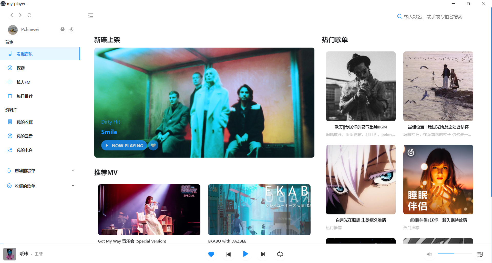
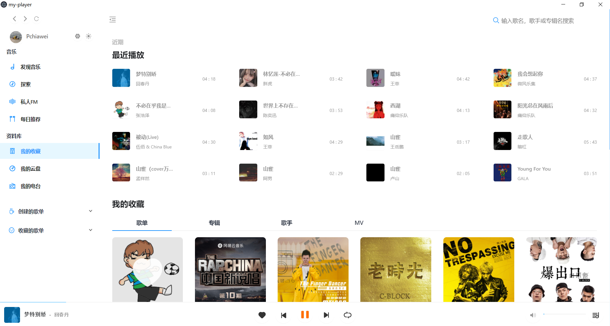
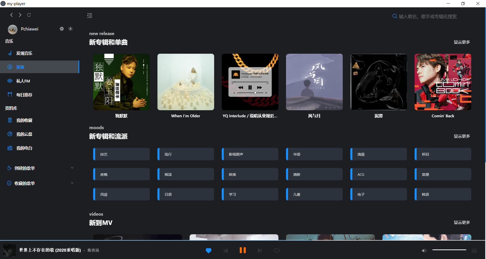
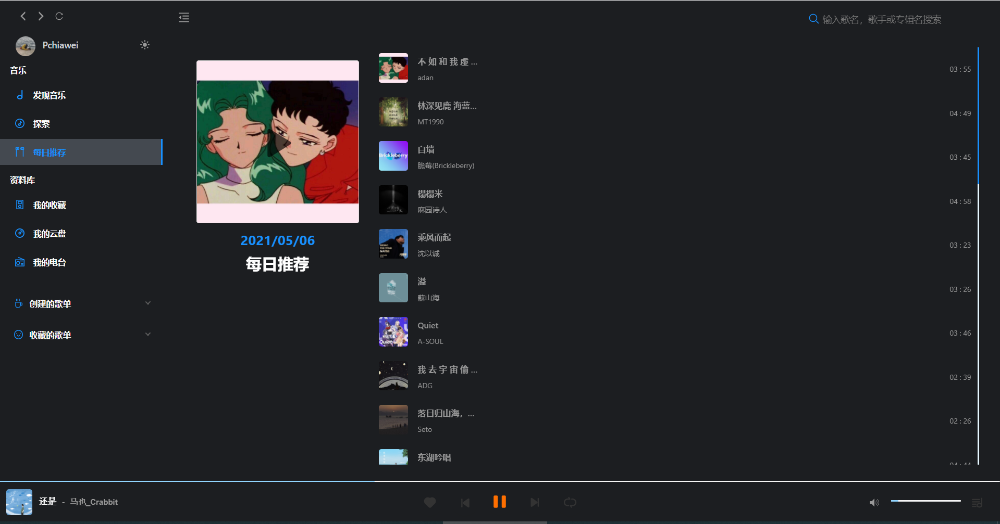
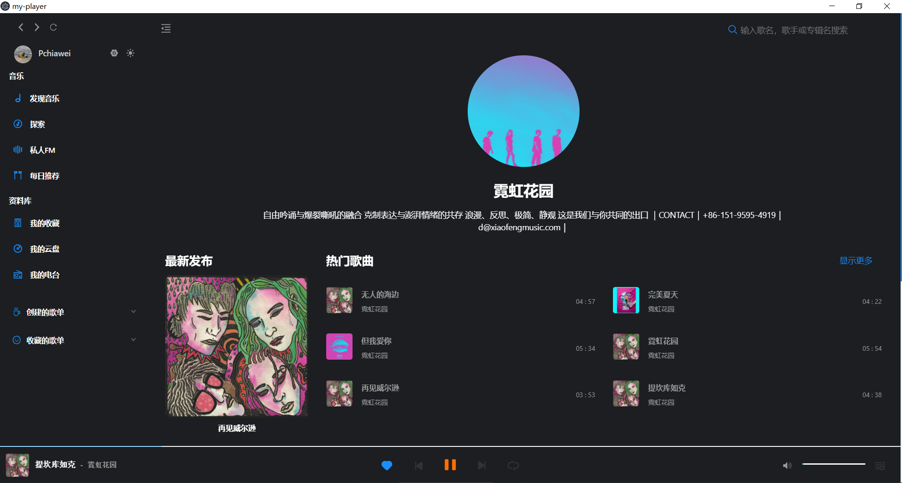
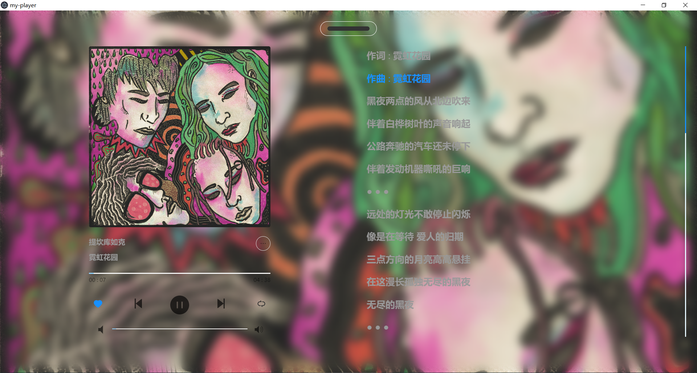

# my-player

### 个人毕设烂大街播放器项目
#### 开发基于Vue全家桶 + [NeteaseCloudMusicApi](https://github.com/Binaryify/NeteaseCloudMusicApi) + Electron-vue 套壳 + Ant Design of Vue 

## 已有功能
- 🥲 简约单纯的播放器，没有网抑云功能
- 📱 目前只支持手机登录
- 📜 歌词，日推
- 🌗 适配夜间模式
- 📦 electron 打包
- 🏗 Work In Progress...正在探索怎么结合qq音乐api

### 安装
```
yarn install
or 
npm install
```

### 启动
```
yarn run dev
```

### 打包
```
yarn run electron:build
```

### 预览效果








### 特别感谢
[Binaryify](https://github.com/Binaryify/NeteaseCloudMusicApi)

[GuMengYu](https://github.com/GuMengYu/v-player)

两位大佬的作品，顶礼膜拜，万分感谢
如有冒犯请与小弟联系

### 仅供个人学习交流使用